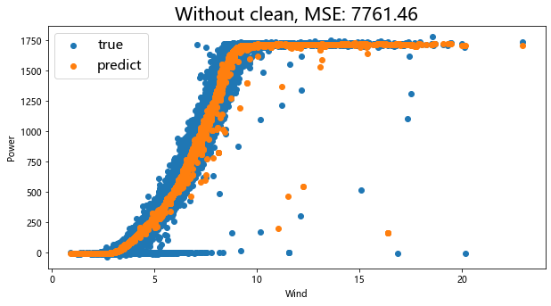
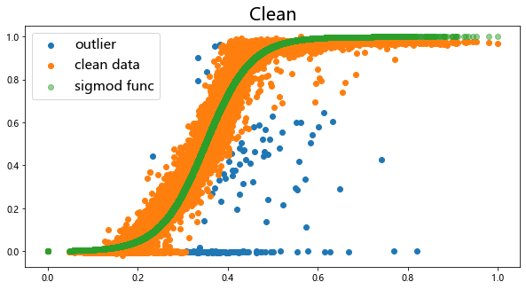
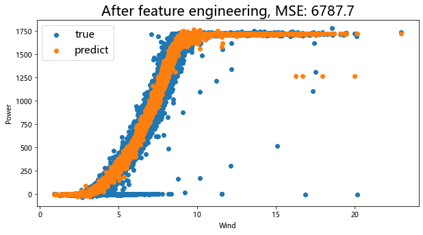

# Wind_Power_Forecasting

## A Meachine Learning Topic about power forecasting
* This is a sample of what I learned during intership

## Feature
* Data Clean
* XGBoost
* Feature Engineering

## Result compare
* Result without data clean

* Clean

* Result after data clean

* Result after feature enngineer

